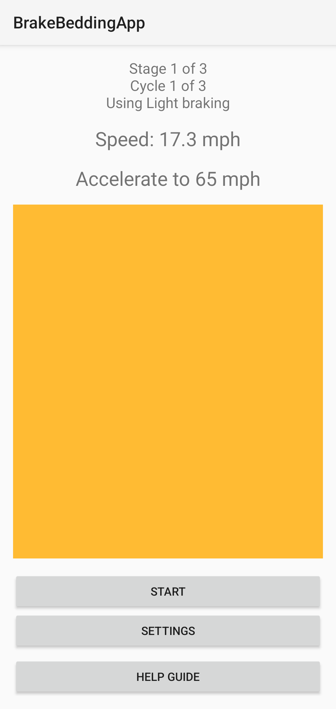
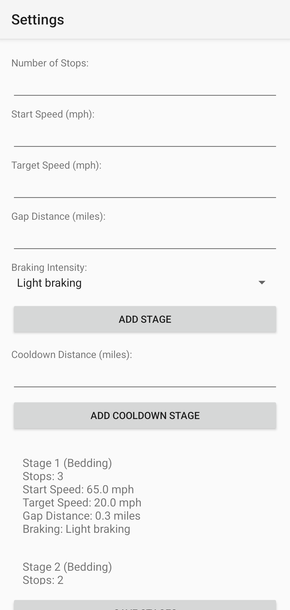
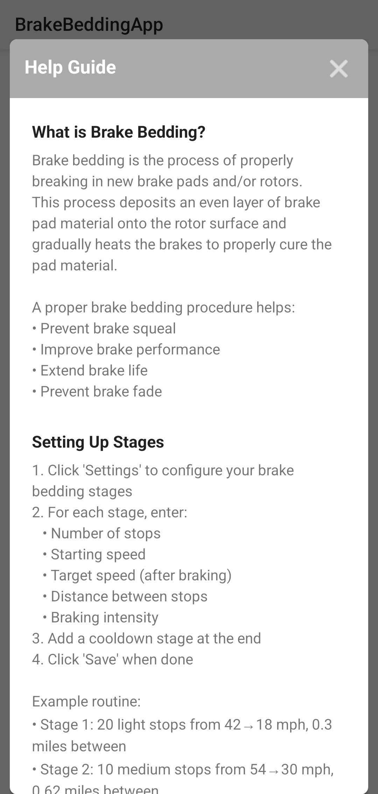

# Brake Bedding App

An Android app to help safely and effectively bed in new brake pads and rotors. This app guides you through the brake bedding procedure with real-time speed monitoring, countdown timers, and visual/audio cues.

## Features

- Create and save custom brake bedding procedures
- Multiple stages with different speeds and intensities
- Real-time speed monitoring
- Visual cues for acceleration, braking, and cooldown periods
- Distance tracking for cooling periods
- Configurable brake intensity levels
- Cooldown stage monitoring

## Screenshots

<p align="center">
  
  
  
</p>

## Installation

1. Download the latest APK from the releases page
2. Enable installation from unknown sources in your Android settings
3. Install the APK
4. Grant location permissions when prompted (required for speed monitoring)

## Usage

### Setting Up a Procedure

1. Launch the app and tap "Settings"
2. For each stage, configure:
    - Number of stops
    - Starting speed
    - Target speed after braking
    - Distance between stops
    - Braking intensity
3. Add a cooldown stage
4. Save your configuration

### Running the Procedure

1. Find a safe, empty road
2. Press "Start" in the app
3. Follow the on-screen instructions:
    - GREEN: Accelerate/drive
    - BLUE: Hold speed
    - RED: Apply brakes
4. Complete all cycles in each stage
5. Follow the cooldown procedure

### Example Procedure

Here's a common brake bedding procedure:
1. 20 light slowdowns from 42 mph to 18 mph, with 0.30 miles between each
2. 10 medium slowdowns from 54 mph to 30 mph, with 0.62 miles between each
3. 10 hard slowdowns (without activating ABS) from 72 mph to 30 mph, minimal distance
4. Cool down by driving 6 miles with minimal braking

## Safety

⚠️ **Important Safety Notes:**
- Only perform brake bedding on empty, safe roads
- Follow all traffic laws and speed limits
- Maintain awareness of your surroundings
- Stop immediately if you smell burning or experience brake fade
- Allow full cool-down before parking
- This app is a guide only - use your judgment and follow manufacturer recommendations

## Development

### Requirements
- Android Studio
- Android SDK 21 or higher
- Location permissions for speed monitoring

### Building
1. Clone the repository:
```bash
git clone https://github.com/nicglazkov/BrakeBeddingApp.git
```
2. Open in Android Studio
3. Build using Gradle

## License
This project is licensed under the MIT License - see the LICENSE file for details.

## Support
For support, please open an issue on the GitHub repository.

[Consider adding badges here for build status, latest version, etc.]

## Disclaimer
This app is provided as-is, without any warranty. Users are responsible for their own safety and should follow manufacturer recommendations for brake bedding procedures.